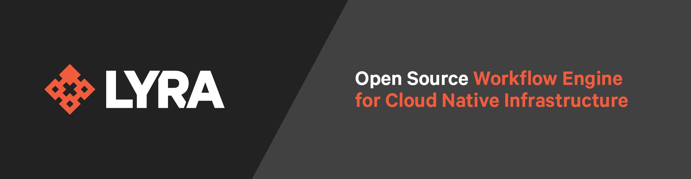
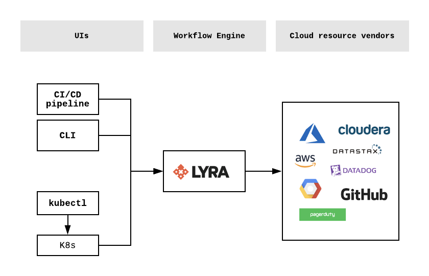

## What is Lyra?

Lyra (“lee-ruh”) is an open source workflow engine for provisioning and managing cloud native infrastructure. Using infrastructure as code, Lyra enables you to declaratively provision and manage public cloud, private cloud, and any API-requested resources as well as orchestrate imperative actions upon them.

Infrastructure management involves defining and executing workflows that manage the underlying resources across their entire lifecycle - performing the initial provisioning, orchestrating intentional changes, and ultimately decommissioning those resources. Lyra is built to help manage all of these types of these workflows.

A Lyra Workflow describes a collection of Activities in a single manifest. An Activity is a declarative resource or imperative action that can be orchestrated together. These include API-requested resources such as Azure Functions, Kubernetes Deployments, and Datadog monitors, as well as imperative actions and scripts. Lyra keeps a record of the resources that Lyra has provisioned in order to ensure idempotency.

Lyra provides a number of language bindings to describe a Workflow, and the workflow engine is decoupled from the language bindings so that other language front-ends can be added to the system.  The first such language binding is Puppet, a popular desired-state configuration language for defining infrastructure-as-code. Other language bindings are being developed, including YAML and TypeScript.

Lyra enables teams to create organization-specific infrastructure Workflows that others can consume in a self-service way.  Lyra is built  to integrate into multiple familiar developer user interfaces, starting with a Kubernetes custom resource definition and controller, and as well as  CI/CD Pipeline and CLI interfaces (coming soon!).

A Workflow can be packaged as a deployable unit and consumed from any of these interfaces. By separating the authoring of the Workflows from their consumption, Lyra enables Application Services teams to provide tested configurations, embedded governance policies, and security validated policies in a single, deployable artifact that Application Developers can provision as dependencies within their containerized application.

For a more detailed view of how we think about Lyra, check out our introductory [document](https://docs.google.com/document/d/1oJwg4LlolC3qlt0xG__xjrz16aYwEyOk8GqyNt5_Gdo/edit?usp=sharing)!

## Getting Started

### Build
The project requires [Go](https://golang.org/doc/install) 1.11 or higher, and [go modules](https://github.com/golang/go/wiki/Modules) to be on.

1. Clone the git repo: `$ git clone https://github.com/lyraproj/lyra`
2. Build the binary: `$ cd lyra; make lyra`

### Deploying Workflows with CLI

> **!! WARNING: THIS WORKFLOW CREATES REAL RESOURCES ($$) !!**

1. Run the binary with the [sample Workflow](plugins/aws_vpc_yaml.yaml): ` $ ./build/lyra apply aws_vpc_yaml --debug`
2. Delete the Workflow (i.e. its resources), run ` $ ./build/lyra delete aws_vpc_yaml --debug`.  

This workflow is an AWS Workflow called `aws_vpc_yaml` in `plugins\aws_vpc_yaml.yaml`. This will use the default AWS credentials configured in your `~/.aws/credentials`. 

For the examples using Terraform providers (e.g. `typespace=>'TerraformAws'`), region is currently hard-coded to `eu-west-1`. For non-Terraform providers (e.g. `typespace=>'aws'`), Lyra will use the default region supplied in your `~/.aws/config`. 

### Deploying Workflows with Kubernetes

> **!! WARNING: THIS WORKFLOW CREATES REAL RESOURCES ($$) !!**

1. Install the Lyra CRD: `$ kubectl apply -f k8s/lyra_v1alpha1_workflow_crd.yaml`
2. Start Lyra in controller mode: ` $ ./build/lyra controller --debug`
3. Create a Workflow resource: `$ kubectl apply -f k8s/aws_vpc.yaml`
4. Inspect the resource: `$ kubectl get workflows` 
5. Delete the Workflow (i.e. its resources): `$ kubectl delete workflow vpc-workflow`

## Project Status
Very much in early development. Lyra is just starting and things are a bit bumpy! Star this project above to stay tuned.

## Roadmap
Here’s a proposed roadmap for the project. Given the infancy of the project, it will change over time. We see the Lyra roadmap evolving in the following three dimensions:

### User Experience
- [x] Core Engine (minimal CLI)
	- [x] Apply
	- [x] Destroy
- [ ] Kubernetes custom resource definition/controller - [**IN PROGRESS**](https://github.com/lyraproj/lyra/issues/37)
- [ ] Full CLI (with preview functionality)
- [ ] GitOps

### Language Support
- [x] Puppet
- [x] YAML
- [ ] TypeScript - [**IN PROGRESS**](https://github.com/lyraproj/lyra/issues/42)
- [ ] Language X (File a [feature request](https://github.com/lyraproj/lyra/issues/new?template=feature_request.md)!)

### Content Ecosystem
- [x] Proof of concept
- [ ] Public cloud providers (AWS, Azure, GCP) - [**IN PROGRESS**](https://github.com/lyraproj/lyra/projects/5)
- [ ] Provider X ecosystem (File a [feature request](https://github.com/lyraproj/lyra/issues/new?template=feature_request.md)!)

## Releases
### [X] Proof of Concept 
* Ability to express resources in a Workflow in Puppet language

### [ ] Release 0.1 - [**IN PROGRESS**](https://github.com/lyraproj/lyra/issues?q=is%3Aopen+is%3Aissue+milestone%3A%22release+0.1%22)
* Ability to create, update, delete resources
* Multiple content providers (e.g. AWS, Azure, GCP and more)
* Ability to package a Workflow
* Ability to expose Workflows as Kubernetes resources
* Ability to preview resources
* Support for YAML, TypeScript

## Contributing
We'd love to get contributions from you! For a quick guide, take a look at our guide to [contributing](CONTRIBUTING.md).
