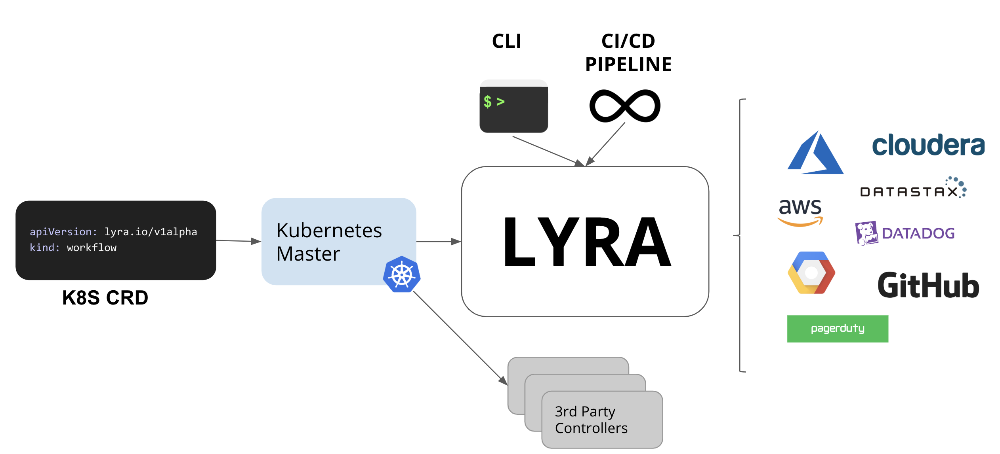

[](https://travis-ci.org/lyraproj/lyra)

<p align="center"></p>

## The Lyra Codebase is Unmaintained

Lyra, the project, was originally intended to be an open source workflow engine for provisioning and managing cloud native infrastructure. As we developed Lyra, it became clear that the end-to-end workflow had a significant amount of overlap with other tools. The use cases for it are closely aligned with cloud native continuous delivery projects like Jenkins X, Tekton Pipelines, and Spinnaker. Rather than reinvent the wheel, we shifted to working upstream with existing projects and communities. 

We've preserved the codebase and documentation in this repository as it may be of interest. If you start to use Lyra, we'd love to hear about it, but please be aware that bugs and feature requests will likely not be addressed.

## What was Lyra?

Lyra (“lee-ruh”) is an open source workflow engine for provisioning and managing cloud native infrastructure. Using infrastructure as code, Lyra enables you to declaratively provision and manage public cloud, private cloud, and other API-backed resources as well as orchestrate imperative actions.

Infrastructure management involves defining and executing workflows that manage the underlying resources across their entire lifecycle - performing the initial provisioning, orchestrating intentional changes, and ultimately decommissioning those resources. Lyra is built to help manage all of these types of these workflows.

A Lyra Workflow describes a collection of Steps in a single manifest. A Step is a declarative resource or imperative action that can be orchestrated together. These include API-requested resources such as Azure Functions, Kubernetes Deployments, and Datadog monitors, as well as imperative actions and scripts. Lyra keeps a record of the resources that it has provisioned in order to ensure idempotency.

Lyra provides a number of language bindings to describe a Workflow, and the workflow engine is decoupled from the language bindings so that other language front-ends can be added to the system. The initial target languages are YAML for getting started, and Typescript for advanced uses. Lyra itself is written in Go and therefore supports Go workflows. Additionally, the project was initially started by Puppet and includes support for a version of the Puppet language.

Lyra enables teams to create organization-specific infrastructure Workflows that others can consume in a self-service way. Lyra is built to integrate into multiple familiar developer user interfaces, starting with a Kubernetes custom resource definition and controller, and as well as  CI/CD Pipeline and CLI interfaces (coming soon!).

<p align="center"></p>

A Workflow can be packaged as a deployable unit and consumed from any of these interfaces. By separating the authoring of the Workflows from their consumption, Lyra enables Application Services teams to provide tested configurations, embedded governance policies, and security validated policies in a single, deployable artifact that Application Developers can provision as dependencies within their containerized application.

For a more detailed view of how we think about Lyra, check out our introductory [document](https://docs.google.com/document/d/1oJwg4LlolC3qlt0xG__xjrz16aYwEyOk8GqyNt5_Gdo/edit?usp=sharing)! 

## Getting Started

The fastest way to get started is with the official Lyra Docker container. You can browse all the available tags and builds on [the Lyra org on dockerhub](https://hub.docker.com/r/lyraproj/lyra) or just grab the latest image: 

1. Create a `lyra-local` directory to save your work locally. 

   ```
   cd
   mkdir lyra-local
   ```

2. Pull the Lyra container:

   ```
   docker pull lyraproj/lyra:latest
   ```

3. Run the container in interactive mode and mount the directory at `/src/lyra/local` to your `local-lyra` directory.

   ```
   docker run -it \
   --mount type=bind,src=$HOME/lyra-local,dst=/src/lyra/local \
   lyraproj/lyra:latest /bin/ash
   ```

Homebrew support is available with:

```
brew install lyraproj/lyra/lyra
```

On other platforms, or if you're interested in hacking on the codebase directly, follow the [build instructions](https://github.com/lyraproj/lyra#build) in the README.

Check out the [example workflows](https://github.com/lyraproj/lyra/tree/master/workflows) to get an idea of what Lyra can do. In particular the ["foobernetes.yaml"](https://github.com/lyraproj/lyra/blob/master/workflows/foobernetes.yaml) has a heavily annotated workflow that describes the deployment of infrastructure to a simple Kubernetes-like service.

## Lyra compared to $tool

There are a number of similar projects and products in this space. The following comparisons are not meant to judge the relative merits of Lyra against them, but rather to provide a frame of reference for users who might be familiar with one or more of them.

### Lyra compared to Terraform

- *Language:* Terraform is tied to HCL (Hashi Config Language), whereas Lyra has a _polyglot_ (multiple language) design. Currently supported language frontends for Lyra are YAML, Typescript, and a variant of the Puppet Language.

- *Imperative actions:* Lyra lets you mix imperative actions (like sending a Slack notification or triggering Github Actions) with declarative resource management. While it's possible to do actions in Terraform, it's working against the desired-state model that's Terraform's core principle.

- *Providers:* Terraform has a rich ecosystem of Providers which enable management of different cloud resources. Lyra has a [bridge](https://github.com/lyraproj/terraform-bridge) which allows it to make use of that ecosystem, but it also can use other content ecosystems, including native Kubernetes interfaces.

- *Kubernetes*: Speaking of Kubernetes, one of Lyra's primary operating modes is as a k8s [Controller](https://github.com/lyraproj/lyra#deploying-workflows-with-kubernetes), allowing it to take part in cluster events and persist beyond point-in-time execution. There is a similar project in [rancher/terraform-operator](https://github.com/rancher/terraform-operator).

### Lyra compared to Pulumi

- *Application Programming*: There are a number of similarities between Lyra and Pulumi: the bridge to Terraform providers, polyglot interfaces, and describing infrastructure that spans cloud services and providers. However, Pulumi's primary users are application developers who want to define the infrastructure configuration their app requires *inside* the app itself. Lyra's primary users are responsible for getting infrastructure working *alongside* the application, allowing people who lean more towards the "ops" side of the "devops" continuum to blueprint app architectures which can then be instantiated for deployments.

- *State*: Pulumi's business relies on users starting off at the free tier of their web service, which stores application state for each "stack" you configure, and upgrading to paid tiers for team and enterprise features. You can opt-out of the service, but it's central to the way Pulumi operates. Lyra manages an identity service which provides a mapping between the resources described in the workflow and the instantiation (the "identity") of those resources in the real world. From Lyra's perspective, the source of truth for state is received from the remote services. This identity is currently stored locally, but we do plan to [move it to a service](https://github.com/lyraproj/lyra/issues/57).

### Lyra compared to Helm

- *Non-Kubernetes deployments*: While Helm is a flexible deployment tool for Kubernetes applications, its ability to deploy to _non-Kubernetes_ APIs is limited. It's great if you're all-in on k8s but many people have only one foot in the kubernetes world and the other in traditional apps. If you're looking for one tool that can be used across deployment scenarios, Helm on its own won't be sufficient.

- *Partial-kube deployments*:  Related, if you have an application composed of some k8s services but depends on, say, an RDS database in EC2 for its backing store, you'd need to deploy and use the [AWS Service Broker](https://aws.amazon.com/partners/servicebroker/), with its attendant complexity, or use your own scripting inside a Job or [init container](https://kubernetes.io/docs/concepts/workloads/pods/init-containers/) to create the instance. Lyra spans both Kubernetes and other cloud providers natively, allowing a single workflow to describe all components of the application, no matter what underlying service provisions them.


## Build

The project requires [Go](https://golang.org/doc/install) 1.11 or higher, and [go modules](https://github.com/golang/go/wiki/Modules) enabled. These instructions should work on Linux and macOS. Proper packages are [coming soon](https://github.com/lyraproj/lyra/issues/12).

1. Clone this repository: `git clone https://github.com/lyraproj/lyra`
2. Build Lyra: `cd lyra; make`
3. Optionally, if you intend to work with typescript, run `make smoke-test-ts` (this will check for an appropriate version of Node.js)

### Deploying Workflows with the Lyra CLI

> **!! WARNING: THIS WORKFLOW CREATES REAL RESOURCES ($$) !!**

1. Apply a [sample Workflow](workflows/aws.yaml): `./build/bin/lyra apply aws --debug`
2. Delete the Workflow (i.e. its resources): `./build/bin/lyra delete aws --debug`

This Workflow manages several resources on AWS and incorporates external data (for Tags, loaded [here](workflows/aws.yaml#L6) using a new Golang implementation of [hiera](https://github.com/lyraproj/hiera)), as specified in the [data.yaml](data.yaml) file. Lyra will use AWS credentials as configured in `~/.aws/credentials`.

> NB regarding regions: For the [examples](workflows/) using Terraform providers (e.g. `typespace=>'TerraformAws'`), region is currently hard-coded to `eu-west-1`. For non-Terraform providers (e.g. `typespace=>'aws'`), Lyra will use the default region supplied in your `~/.aws/config`.

There are also more examples of workflows for various cloud providers specified in [yaml](workflows) and in [TypeScript](examples/ts-samples/src/).  All TypeScript examples require NodeJs version 9 or greater (`node --version`) - see [https://nodejs.org/en/download/]().  To run [a basic sample](examples/ts-samples/src/sample_ts.ts), run `make smoke-test-ts`.  This will run an npm install (`(cd examples/ts-samples && npm install)`) and then `build/bin/lyra apply sample_ts --debug`.

### Deploying Workflows with Kubernetes

> **!! WARNING: THIS WORKFLOW CREATES REAL RESOURCES ($$) !!**

1. Install the Lyra Workflow CRD: `kubectl apply -f k8s/lyra_v1alpha1_workflow_crd.yaml`
2. Start Lyra in controller mode: `./build/bin/lyra controller --debug`
3. In another terminal window, create a Workflow resource: `kubectl apply -f k8s/vpc-workflow.yaml`
4. Inspect the resource: `kubectl get workflows`
5. Delete the Workflow (i.e. its resources): `kubectl delete workflow vpc-workflow`

Tag data for Kubernetes workflows is specified in the data section of [k8s/vpc-workflow.yaml](k8s/vpc-workflow.yaml#L8-L12).
