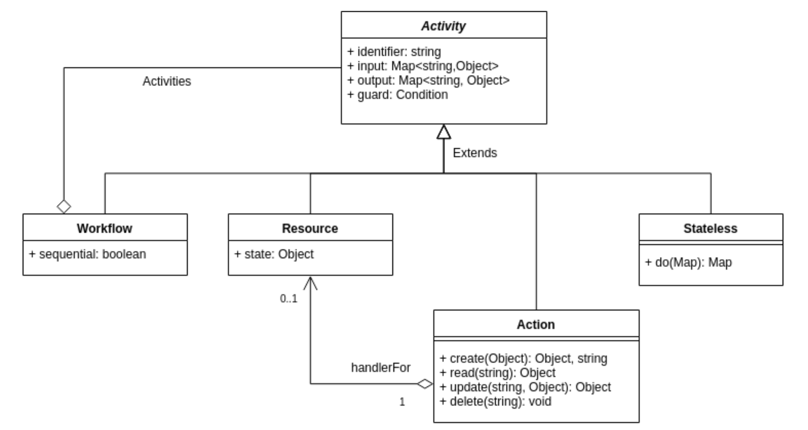

# Building blocks

Consists of a Provider Framework, a Lookup Framework, a Workflow Engine, and polyglot Language front-ends.

## Workflow
A Workflow describes a collection of Activities and must be declared in such a way that all input requirements of all contained activities have the potential to be fulfilled within the workflow itself.
The workflow engine loads this declaration, validates it, and invokes its activities in an order determined by their input and output declarations. The workflow can be packaged into a deployable unit (coming soon!).

## Activity
An Activity is an abstract executable unit, analog to “a function in a program”, that consumes inputs and produces outputs. The workflow engine triggers its execution when all its input requirements are met. When several activities are grouped into a workflow, the execution in turn produces output available as input to other activities which then get triggered. In essence, this means that all ordering of activities and all concerns regarding parallel or sequential execution, can be expressed as input requirements and output declarations that fulfills them.

An activity will always have a Guard. A Guard is an expression consisting of named variables,  the boolean operators “!”, “and”, and “or”. It may also contain parentheses to enforce order of evaluation. The default guard is the expression “true” which not surprisingly, always evaluates to true.

An Activity may be embedded in a workflow, in which case it can only be seen by the workflow that contains it, or be public, in which case it can be referenced from anywhere. A CLI command will typically invoke a public workflow.

An Activity can be a Resource, an Action, a Stateless, or a Workflow.

## Resource
A special form of declarative activity that defines a desired state. A resource is always managed by a provider responsible for setting or mutating its state. The inputs to a resource can be used to define state attributes and the output is values of selected attributes once the state has been applied.

## Action
An activity that contains CRUD (Create, Read, Update, Delete) functions written in a supported programming language. The workflow engine selects the functions to be evaluated and the evaluation is then performed by the corresponding language front-end.

## Stateless
An activity that contains a function written in a supported programming language. The code is evaluated by the corresponding language front-end.
